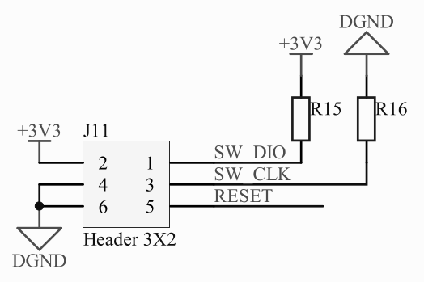

= Kingroon KP3S without beep on boot

Patched bootloader for Kingroon KP3S 3D printer that doesn't beep when powering on.

## How to install

. *Setup https://github.com/windowsair/wireless-esp8266-dap[wireless-esp8266-dap] on ESP8266 and install OpenOCD.*
[NOTE]
You can use any SWD compatible programmer (like ST-link). I didn't have one so I've used ESP8266.
. *Connect SWD to Kingroon board.*
+

. *Run OpenOCD and open telnet shell.*
+
In terminal:
[source,bash]
openocd -f interface/cmsis-dap.cfg -f target/stm32f1x.cfg -c 'transport select swd'
+
In another terminal:
[source,bash]
telnet localhost 4444

. *Make a backup.*
+
In OpenOCD telnet shell:
[source,openocd]
flash read_bank 0 firmware-fullfull.bin

. *Write patched bootloader.* +
You need to put link:./firmware-bootloader-only-patched.bin[] in your working directory.
+
In OpenOCD telnet shell:
[source,openocd]
flash write_image erase firmware-bootloader-only-patched.bin 0x08000000
. *Done.* +
Write `reset` in OpenOCD terminal and check if it still beeps.

## NAQ (Nobody Asked Questions)

### How did you come up with this?

1. I've dumped the whole memory with OpenOCD.
2. Then disassembled with Ghidra. 
3. Found the instruction that sets the beeper GPIO pin (PC5).
4. Turned it into NOP by patching with ImHex.

### What is in the patch?
It's in IPS file. You can apply it with e.g. ImHex. +
There are two places: GPIO set and GPIO reset:

- 0x4F42: `FB F7 36 FD` → `00 BF 00 BF`
- 0x4F48: `FE F7 80 FE` → `00 BF 00 BF`

`00 BF 00 BF` in ARM Thumb is `NOP NOP`.

### What if I like beep and I want to return to the original bootloader?
🤮
[source,openocd]
flash write_image erase firmware-bootloader-only.bin 0x08000000